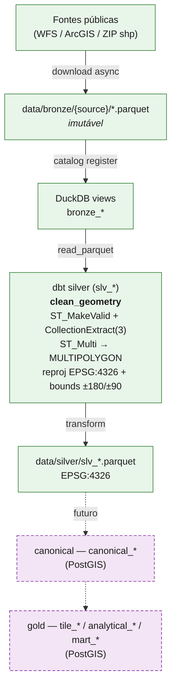

# terrasync — Architecture

> Snapshot estável: visão, escopo, arquitetura consolidada, glossário.
> Para histórico de sessões, decisões em andamento e próximos passos, ver [../ai_history.md](../ai_history.md).
> Para arquitetura futura das camadas silver/gold (PostGIS), ver [blueprint_geo_pipeline.md](blueprint_geo_pipeline.md).
> Invariantes geo e convenções de naming/uso estão no [../CLAUDE.md](../CLAUDE.md).

## Visão

CLI Python para ingestão bulk de dados geoespaciais brasileiros de fontes públicas, padronização via dbt e cruzamentos territoriais para análise fundiária e ambiental.

Foco temático: **governança de terra e Código Florestal** — cadastro rural (CAR/SIGEF/SNCI), terras indígenas, unidades de conservação, quilombolas, assentamentos, desmatamento, embargos.

## Escopo

### Faz parte
- Aquisição (WFS / ArcGIS REST / ZIP shapefile) com retry, paginação e cache
- Armazenamento em parquet seguindo arquitetura **medallion 4-tier** (bronze → silver implementados; canonical → gold como alvo em PostGIS)
- Catálogo DuckDB com views sobre os parquets bronze
- Limpeza e padronização de geometria via dbt (camada silver, EPSG:4326)
- Configuração declarativa de fontes em YAML
- Notebook exploratório com mapa Leaflet

### Não faz parte (no escopo atual)
- Camada silver/gold em PostGIS (alvo do blueprint, não implementado)
- Visualização tipo dashboard ou API de consulta
- Aquisição de imagens raster
- Geocoding ou reverse geocoding
- Análise estatística pronta — apenas o substrato espacial limpo

## Arquitetura



Camadas medallion:

| Camada | Conteúdo | Storage | Engine |
|---|---|---|---|
| **bronze** | raw imutável da origem | `data/bronze/{source}/*.parquet` | n/a (downloader) |
| **silver** | geometrias válidas em EPSG:4326, bounds OK | `data/silver/slv_*.parquet` | DuckDB |
| **canonical** (futuro) | canônico, sem topologia inválida | PostGIS schema `silver` | PostGIS `ST_Coverage*` |
| **gold** (futuro) | overlays por tile/UF/bioma, marts | PostGIS schema `gold` | PostGIS |

## Estrutura de pastas (monorepo)

```
terrasync/
├── pyproject.toml                   # uv-managed; descobre apps/terrasync via [tool.hatch.build.targets.wheel]
├── uv.lock
├── apps/
│   ├── terrasync/                   # pacote Python (ingestion engine + CLI)
│   │   ├── paths.py                 # repo_root() + DATA_DIR + DBT_DIR (cwd-independente)
│   │   ├── config.py                # pydantic models + loader + resolve_sources()
│   │   ├── sources.yaml             # catálogo declarativo (única fonte da verdade)
│   │   ├── main.py                  # CLI: ingest / transform / catalog
│   │   ├── catalog.py               # registra views bronze_{source}_{layer}
│   │   ├── manifest.py              # acquisition log: footer metadata + runs.jsonl
│   │   ├── logging_config.py
│   │   └── downloader/              # pacote: 3 estratégias + dispatcher
│   │       ├── __init__.py          # API pública: download_all, download_layer
│   │       ├── orchestrator.py      # dispatch por tipo de source
│   │       ├── wfs_json.py          # WFS paginação JSON
│   │       ├── wfs_gml.py           # WFS GML (i3geo)
│   │       ├── arcgis.py            # ArcGIS REST FeatureServer
│   │       ├── zip_shp.py           # ZIP shapefile com cache
│   │       └── io.py                # filesystem/SSL helpers
│   ├── dbt/                         # projeto dbt (cwd para `dbt` direto)
│   │   ├── dbt_project.yml          # var: data_root = ../../data
│   │   ├── profiles.yml             # DuckDB profile (path: ../../data/terrasync.duckdb)
│   │   ├── packages.yml
│   │   ├── macros/
│   │   │   ├── clean_geometry.sql   # gateway de silver
│   │   │   ├── area_ha.sql          # área via EPSG:5880 sob demanda
│   │   │   ├── bronze_path.sql      # {{ bronze_path('source') }} → ../../data/bronze/<source>/*.parquet
│   │   │   ├── silver_path.sql      # {{ silver_path('slv_X') }} → ../../data/silver/slv_X.parquet
│   │   │   └── export_path.sql      # {{ export_path('cliente', 'modelo') }} → ../../data/exports/.../v=YYYY-MM-DD
│   │   ├── models/
│   │   │   ├── silver/              # 11 slv_*.sql (DuckDB)
│   │   │   ├── exports/<cliente>/   # ex.: scw/sicar_opi.sql
│   │   │   ├── silver/canonical/ (futuro)  # canonical_*.sql (PostGIS)
│   │   │   └── gold/    (futuro)    # tile_*/analytical_*/mart_*.sql (PostGIS)
│   │   ├── seeds/    snapshots/    tests/    analyses/
│   ├── api/  (placeholder)          # futuro: API HTTP
│   └── web/  (placeholder)          # futuro: frontend JS/React
├── infra/
│   ├── docker-compose.yml           # cwd para `docker compose`; volume ../data/silver
│   └── docker/postgres/             # Dockerfile + init/10-extensions.sql + postgresql.conf
├── data/                            # gerado, gitignored — recurso compartilhado
│   ├── bronze/                      # raw parquet por source/layer
│   ├── silver/                      # parquet pós-clean_geometry (EPSG:4326)
│   ├── exports/<cliente>/           # extrações de cliente, versionadas por v=YYYY-MM-DD
│   ├── cache/                       # ZIPs transientes
│   ├── manifests/                   # runs.jsonl — log estruturado de aquisição
│   └── terrasync.duckdb             # catálogo
├── docs/
│   ├── architecture.md              # este arquivo
│   └── blueprint_geo_pipeline.md    # referência canônica do alvo silver/gold
├── notebooks/                       # exploração com folium (vazio hoje)
├── CLAUDE.md
├── README.md
└── ai_history.md
```

**Estratégia de paths** — modelos SQL nunca escrevem `data/...` literal. Três macros (`bronze_path`, `silver_path`, `export_path`) emitem `{{ var('data_root') }}/...` com `data_root: "../../data"` (relativo a `apps/dbt/`, cwd do dbt). No Python, `apps/terrasync/paths.py:repo_root()` sobe a árvore até achar `pyproject.toml` e expõe `DATA_DIR`, `DBT_DIR`, `DBT_TARGET` absolutos — CLI funciona de qualquer cwd. `_ensure_external_dirs` em `main.py` resolve as `location`s relativas do manifest contra `DBT_DIR` antes de `mkdir`.

## Modelos de dados de fonte (pydantic)

Três tipos de fonte cobrem todas as 20 sources atuais:

| Tipo | Estratégia de download | Quando usar |
|------|-----------------------|-------------|
| `WFSSource` | Paginação JSON via `GetFeature` com `count`/`startIndex`. Variante `use_gml=true` baixa response completo em GML (sem paginação) para servidores i3geo que não suportam `outputFormat=application/json`. | Servidores GeoServer / WFS padrão. |
| `ArcGISSource` | Paginação via `resultOffset`/`resultRecordCount`, output GeoJSON. | Servidores ArcGIS REST FeatureServer. |
| `ZipShapefileSource` | Download de ZIP → cache em `data/cache/{source}.zip` → unzip em tempdir → shapefile lido em chunks (`pyogrio`) e escrito em parquet via `ParquetWriter`. ZIP é removido só após sucesso do parquet. | Distribuições estáticas em shapefile zip (atualmente desabilitado para fontes INCRA em favor de WFS). |

Cada source pode pertencer a um **group** (ex.: `incra`, `prodes`, `deter`). Groups permitem `--source incra` baixar 6 sub-sources. `--source all` baixa tudo. Quando há `group`, o bronze fica em `data/bronze/{group}/{source}_{layer}.parquet`; sem group, em `data/bronze/{source}/{layer}.parquet`.

## Fontes (20 sources)

Detalhes completos em [../apps/terrasync/sources.yaml](../apps/terrasync/sources.yaml).

| Categoria | Sources |
|-----------|---------|
| **CAR** | sicar (27 UFs) |
| **Terras Indígenas** | funai |
| **INCRA** | incra_quilombolas, incra_sigef_privado/publico, incra_snci_privado/publico, incra_assentamentos |
| **Unidades de Conservação** | icmbio |
| **Embargos ambientais** | ibama |
| **PRODES (desmatamento anual)** | 6 biomas: amazonia, cerrado, caatinga, mata_atlantica, pantanal, pampa |
| **DETER (alertas em tempo quase-real)** | 2 biomas: amazonia, cerrado |
| **Recursos hídricos** | ana (4 layers: hidrografia, pivos, demanda, disponibilidade) |
| **Florestas públicas** | sfb (3 layers: cnfp, concessoes, ifn_conglomerados) |

## CLI

```
terrasync ingest --source <source|group|all> [--layers ID...] [--reset] [--debug]
terrasync transform [--select SELECTOR] [--full-refresh]
terrasync catalog
```

- `ingest` baixa para bronze + atualiza catálogo DuckDB ao final.
- `transform` é `dbt run` empacotado (profile e project-dir já apontam para a raiz).
- `catalog` resincroniza views se parquets foram movidos fora do CLI.
- `--layers` aceita IDs de layer (`sp`, `mg`) ou, quando `--source` é um group, nomes de sub-sources (`incra_sigef_privado`).
- Fault tolerance: source que falha em multi-source não aborta as demais.

## Decisões arquiteturais consolidadas

### Medallion 4-tier com dbt no meio
Bronze é parquet bruto exatamente como recebido da API. **Silver** (DuckDB) é resultado da macro `clean_geometry` aplicada via dbt + DuckDB spatial — `slv_*` models em parquet EPSG:4326. **Canonical** e **gold** são camadas-alvo em PostGIS (blueprint), ainda não implementadas. Razão: separar aquisição (lenta, propensa a falha, sem lógica de negócio) de transformação (rápida, idempotente, versionada em SQL); isolar topologia pesada (`ST_Coverage*`) no engine certo (PostGIS) quando o custo justificar.

### DuckDB como catálogo, não como warehouse
DuckDB cria *views* sobre parquets bronze (não materializa) e materializa silver como external parquet (`slv_*`). Razão: arquivos são a fonte da verdade; DuckDB é a interface SQL/spatial. Permite ler bronze/silver fora do CLI com qualquer ferramenta que leia parquet.

### Configuração declarativa em YAML, código curto
`sources.yaml` (~430 linhas) é a única fonte da verdade dos endpoints, layers, paginação e geometria. `config.py` é só loader pydantic. Adicionar uma fonte = editar YAML + criar `slv_*.sql`. Sem código.

### 3 estratégias de download num pacote com dispatcher fino
`downloader/` agrupa WFS (JSON + GML), ArcGIS REST e ZIP shapefile em módulos por estratégia (`wfs_json.py`, `wfs_gml.py`, `arcgis.py`, `zip_shp.py`), com `orchestrator.py` dispatchando por tipo de `DataSource` e `io.py` concentrando **todos** os side effects de filesystem (`save_geodataframe`, `remove_layer`, `parquet_path`) e a configuração de SSL. Razão: o módulo único de 445 linhas tinha virado catch-all e violava o anti-pattern "hidden side effects scattered"; a divisão por estratégia + um único `io.py` para FS preserva o reuso de helpers (que motivou a unificação anterior em S4) sem sacrificar legibilidade. API pública (`download_all`, `download_layer`) é estável — `main.py` e `catalog.py` não mudam.

### Macro única `clean_geometry` como gateway de silver
Todos os 11 silver models chamam a mesma macro. Saneamento canônico:
1. `ST_MakeValid` em geometrias inválidas
2. `ST_CollectionExtract(geom, 3)` força saída para polígonos (descarta points/lines que surgem de `MakeValid` de polígonos quase-degenerados)
3. `ST_Multi` normaliza saída para **`MULTIPOLYGON`** (tipo uniforme em todas as layers a jusante)
4. Reprojeção para **EPSG:4326** (parâmetro `source_epsg` no macro; default 4674 SIRGAS 2000)
5. Filtra bounds geográficos válidos (`±180/±90`)

Padronização vence variação. Se uma fonte exigir limpeza diferente, é melhor refletir isso na macro do que pulverizar SQL custom.

A macro aceita um caminho de parquet literal (`parquet_path`) **ou** um parâmetro `relation` — um `SELECT` montado pelo chamador, usado quando o `slv_*` precisa abrir as colunas explicitamente (ex.: `slv_sicar`, cujos estados têm schema divergente). Ambos os caminhos passam pela mesma CTE `raw`; o gateway de saneamento permanece único.

### CRS canônico: storage 4326, área via 5880
Geometrias são armazenadas em **EPSG:4326** (graus). Cálculo de área usa **EPSG:5880** (Albers Brasil, equal-area) via macro `area_ha(geom)` sob demanda. Reprojeção em massa para 5880 no storage foi explicitamente recusada: custo > benefício enquanto a área é sob demanda.

### Paginação calibrada por `GetCapabilities`
`page_size` é fixado por source com base nos limites reais do servidor (não em chute). Ex.: INPE/DETER suporta 100k, ICMBio 100k, IBAMA 50k. Documentado em `sources.yaml`.

### Fontes i3geo recebem caminho GML separado
Servidor `acervofundiario.incra.gov.br` (i3geo) responde `ServiceException` para `outputFormat=application/json`. `use_gml: true` em `sources.yaml` ativa `_wfs_fetch_gml`: request sem `outputFormat`/`maxFeatures`, salva response em `.gml` temp, parseia via `gpd.read_file`. Trade-off aceito: sem paginação, mas com cobertura.

### Cache de ZIP só sobrevive falha de parsing
Para `zip_shapefile`, o ZIP fica em `data/cache/` *durante* o download e *após* sucesso da parquetização é apagado. Se o parquet falhar, o ZIP permanece — próxima execução pula download. `--reset` limpa ambos.

### Provenance de aquisição em dois lugares (footer + manifest)
Cada parquet bronze carrega no **footer key-value** (`terrasync.acquired_at`, `source`, `layer_id`, `endpoint`, `source_epsg`, `n_features`) — metadado vive com o arquivo, zero overhead de schema. Em paralelo, cada tentativa de download (`ok`/`empty`/`failed`) gera uma linha JSON em `data/manifests/runs.jsonl`, consultável via `read_json_auto` no DuckDB. Razão: timestamp por feature violaria bronze imutável e seria desperdício de schema (mesmo valor em milhões de linhas); a aquisição é fato do arquivo, não da feature. Parquets pré-existentes ao patch ficam sem o metadado por design — fabricar uma data retroativa seria gravar dado falso.

### Branches de dados por cliente
O tronco bronze + silver é **single-tenant compartilhado**: aquisição, validação e projeção de geometria servem a todos. A partir de silver, cada cliente recebe **branches** próprias — modelos de *export* que recortam e moldam o tronco para um entregável. Primeira branch: `scw` (projeto `opi`), com `sicar_opi` — recorte de 11 UFs do SICAR.

Um export **não é canonical**: canonical (PostGIS, contract enforced) é a canônica topologicamente limpa; export é um corte de cliente de um upstream, materializado como parquet `external` versionado. Hoje `sicar_opi` lê de `slv_sicar`; quando a canônica PostGIS existir, um export equivalente lerá dela.

Versionamento por diretório particionado: `data/exports/<cliente>/<modelo>/v=YYYY-MM-DD/<modelo>.parquet`, dirigido pela dbt var `<cliente>_data_version` (default `run_started_at`). Histórico imutável, glob-readable, "latest" = maior `v=`.

### Notebook ao invés de viewer web
Foi prototipado um subcomando `terrasync view` com Leaflet HTML e descartado. Razão: notebook (folium + jupyter) já cobre exploração ad-hoc sem manter código de UI. Sem viewer module.

## Glossário

### Domínio
| Termo | Significado |
|-------|-------------|
| **CAR** | Cadastro Ambiental Rural — registro obrigatório de imóveis rurais com geometria |
| **SICAR** | Sistema Nacional de CAR (operado pelo Serviço Florestal Brasileiro) |
| **SIGEF** | Sistema de Gestão Fundiária — certificação de parcelas privadas/públicas (INCRA) |
| **SNCI** | Sistema Nacional de Certificação de Imóveis — predecessor do SIGEF, ainda ativo |
| **TI** | Terra Indígena (FUNAI) |
| **UC** | Unidade de Conservação (ICMBio: federais; órgãos estaduais: UCs estaduais) |
| **PRODES** | Programa de monitoramento de desmatamento por corte raso (INPE), anual |
| **DETER** | Detecção em tempo quase-real de desmatamento (INPE), alertas |
| **Quilombola** | Área quilombola titulada/em titulação |
| **Embargo** | Área onde IBAMA proibiu uso por infração ambiental |
| **Assentamento** | Projeto de reforma agrária (INCRA) |
| **Módulo fiscal** | Unidade de medida agrária variável por município |
| **Bioma** | Amazônia, Cerrado, Caatinga, Mata Atlântica, Pantanal, Pampa |

### Técnico
| Termo | Significado |
|-------|-------------|
| **WFS** | Web Feature Service — padrão OGC para servir features geográficas |
| **ArcGIS REST** | API REST de FeatureServer (Esri) |
| **GML** | Geography Markup Language — formato XML para geo, usado quando JSON não está disponível |
| **EPSG:4326** | WGS 84 geográfico |
| **EPSG:4674** | SIRGAS 2000 geográfico — datum oficial brasileiro; SRID de origem mais comum |
| **EPSG:5880** | SIRGAS 2000 / Brazil Polyconic — equal-area BR |
| **Bronze/Silver/Canonical/Gold** | Camadas medallion 4-tier (ver §Arquitetura) |
| **Coverage** | Conjunto de polígonos não-sobrepostos com edges idênticos (vocabulário PostGIS `ST_Coverage*`) |
| **Tile** | Célula do grid espacial (~700 tiles 0.5° no BR) usada como unidade de paralelismo no overlay |
| **i3geo** | Framework open-source que serve mapas; INCRA usa em `acervofundiario.incra.gov.br` |

## Dependências chave

Runtime: `httpx`, `geopandas`, `pandas`, `pyogrio`, `tenacity`, `duckdb`, `pyarrow`, `dbt-core`, `dbt-duckdb`, `pydantic`, `pyyaml`, `fiona`.

Dev: `folium`, `jupyter`.

Gerenciador: `uv` (lockfile em `uv.lock`, dependencies em `pyproject.toml`). Python `>=3.12`.

## Como adicionar uma fonte nova

1. Editar `apps/terrasync/sources.yaml` com a entrada da source (tipo, endpoint, layers, paginação, EPSG, geometry_type).
2. Se for nova categoria de fonte, talvez registrar um `group`.
3. Criar `apps/dbt/models/silver/<provider>/slv_{source}.sql` — ver `docs/workflows/add_polygon_source.md`.
4. Criar `apps/dbt/models/silver/<provider>/schema.yml` co-localizado.
5. Rodar `uv run terrasync ingest --source <novo>` para validar.
6. Rodar `uv run terrasync transform --select slv_<novo>` para validar limpeza.

Não há código novo a escrever para WFS, ArcGIS REST ou ZIP shapefile padrão — só YAML + SQL.
